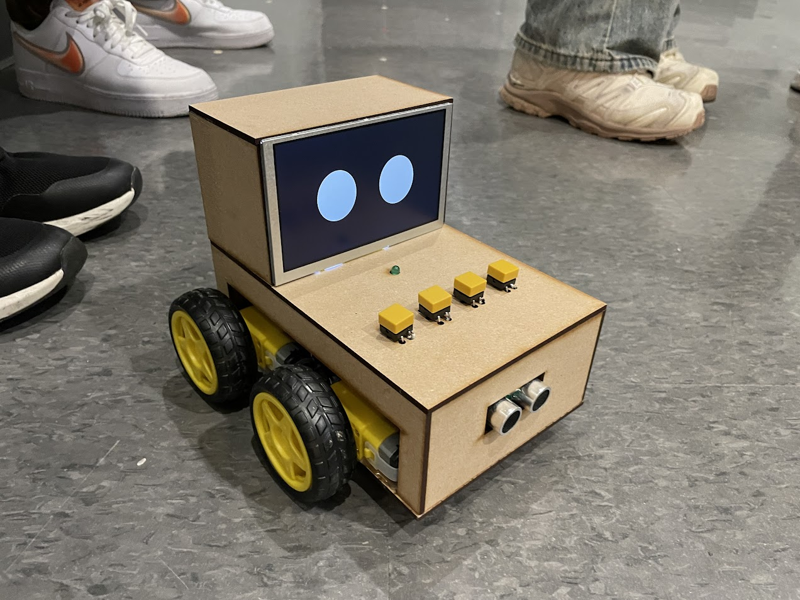

# Alarmo Robot — Mobile Alarm Clock That Runs Away (ATmega328PB, Bare-Metal C)

Alarmo is a **mobile alarm clock robot** designed to solve oversleeping by forcing physical interaction: when the alarm triggers, the robot **drives away from the user**, plays a loud buzzer, and **avoids obstacles** to make “snooze-in-bed” difficult.

## Demo
- YouTube: https://www.youtube.com/watch?v=o-xq1MFMQaQ

## Highlights
- **Bare-metal embedded C** on **ATmega328PB**
- **RTC-scheduled alarm** + loud buzzer (~70–90 dB target range)
- **PWM motor control** + **ultrasonic obstacle avoidance**
- **Large SPI LCD** with a **custom driver** and simple UI animations
- **Compact integrated build** with a battery + efficient power path

---

## My Role (Yuhe Zhang)
I implemented key firmware + integration pieces for the prototype:
- Built the firmware in **bare-metal C** on ATmega328PB
- Implemented **alarm scheduling**, **PWM motor control**, and **obstacle detection**
- Wrote/maintained an **LCD interface library** (SPI) and integrated UI workflow
- Improved power efficiency by leveraging the **motor driver as a buck converter** in the system power design

---

## What it does
### Movement System
- Drives using DC motors controlled by a motor driver
- Uses an ultrasonic distance sensor to detect nearby obstacles and adjust direction

### Alarm System
- RTC triggers the alarm at a set time
- Buzzer produces a loud, adjustable alarm tone (designed around ~70–90 dB)

### User Interface
- Large LCD shows system time / alarm time / mode state
- 4-button control for setting time, switching modes, and reset
- Small UI animations on the LCD for better interaction

---

## Hardware Overview
- **MCU:** ATmega328PB
- **Actuation:** DC motors + motor driver (also used as power converter)
- **Sensing:** Ultrasonic distance sensor (collision avoidance)
- **Timekeeping:** RTC module (accurate alarm scheduling)
- **Output:** Buzzer + large SPI LCD
- **Input:** 4 buttons
- **Power:** Battery supply with an efficient regulated path
- **Mechanical:** Compact enclosure (3D-printed / fitted case)

---

## Firmware Architecture (high-level)
- `rtc/` — timekeeping + alarm scheduling
- `motor/` — PWM motor control (forward/turn behaviors)
- `ultrasonic/` — distance measurement + obstacle logic
- `lcd/` — custom LCD driver (SPI) + UI rendering
- `button/` — debounced button inputs + mode/state transitions
- `app/` — main state machine (idle → pre-alarm → alarm + run-away → stop)

> Folder names above are a recommended structure for portfolio presentation; align to your repo as needed.

---

## How it works (state machine)
1. **Idle / Normal mode**: display current time, allow setting alarm time
2. **Pre-alarm**: prepare motors / UI state shortly before alarm (optional)
3. **Alarm triggered**: buzzer ON + robot drives away
4. **Obstacle avoidance**: if distance < threshold, turn and continue
5. **Stop condition**: user stops/reset via button (and/or timeout)

---

## Build & Flash (example workflow)
> This is a typical AVR bare-metal workflow. Update the programmer/port/MCU settings to match your setup.

### Requirements
- avr-gcc / avr-libc
- make
- avrdude (or your preferred flashing tool)

### Build
```bash
make clean
make
