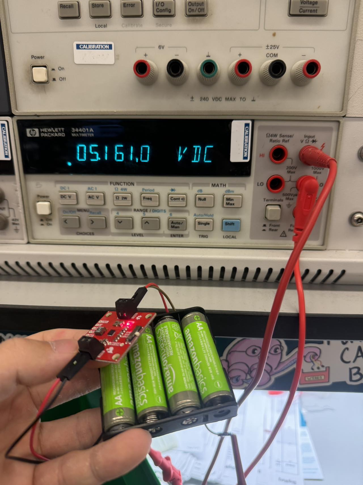

    * Team Name: Hugging overflow
    * Team Members: Peng su, Jiayang Li and Yuhe Zhang
    * Github Repository URL: https://github.com/upenn-embedded/final-project-hugging-overflow
    * Github Pages Website URL: https://upenn-embedded.github.io/final-project-hugging-overflow/
    * Description of hardware: (embedded hardware, laptop, etc) ATmega328PB

## Final Project Report

Don't forget to make the GitHub pages public website!
If you’ve never made a Github pages website before, you can follow this webpage (though, substitute your final project repository for the Github username one in the quickstart guide):  <https://docs.github.com/en/pages/quickstart>

### 1. Video

[Amazing Alarmo](https://youtu.be/o-xq1MFMQaQ)

### 2. Images

### 3. Results

The final solution to the problem of oversleeping was a mobile alarm clock designed to force physical interaction by moving away from the user as the alarm sounds. This innovative design aimed to make it much harder to snooze the alarm without fully waking up. Below are the key features and components of the final design:

### Movement System
- The clock uses motors and a motor driver to enable mobility.
- The ultrasonic distance sensor prevents collisions by detecting obstacles and adjusting the movement path.
- The motor driver also functions as a buck converter, efficiently powering the microcontroller and peripherals.

### Alarm System
- A buzzer emits a loud, adjustable alarm tone ranging from 70-90dB, ensuring it is noticeable enough to wake the user.
- The alarm is triggered by the real-time clock (RTC) at the set time.

### User Interface
- A large, custom-driven LCD displays system time, alarm time, and other settings.
- Four buttons provide intuitive controls for setting time, switching modes, and resetting the system.
- Animations on the LCD enhance usability and add an interactive feel.

### Obstacle Avoidance
- The system continuously measures distances using the ultrasonic sensor and ensures the device moves away from obstacles by turning or stopping when necessary.

### Compact and Integrated Design
- The components, including motors, sensors, buttons, LCD, and wiring, were carefully fitted into a compact case.
- This neat assembly reduced clutter while maintaining functionality.

### Real-Time Clock Integration
- The RTC module ensured precise timekeeping and accurate alarm scheduling.
- The system reliably switched between alarm time setting and system time display modes.

---

### Achievements
- **Functionality:** The system performed as intended, waking the user by combining sound, motion, and physical interaction requirements.
- **Robustness:** All major components worked seamlessly together, including real-time clock scheduling, obstacle avoidance, and user inputs.
- **Efficiency:** The motor driver doubled as a buck converter, simplifying the power system and ensuring efficient energy usage.

---

### Overall Impact
This design successfully addressed the problem of oversleeping by introducing an engaging and interactive solution. It combined multiple embedded systems concepts into a cohesive and effective product, achieving the goal of making snoozing difficult and waking up unavoidable.

#### 3.1 Software Requirements Specification (SRS) Results

Most SRS achieved.

Software Performance Metrics:

SRS 01: IMU 3-axis acceleration measurement every 100ms ±10ms – Abandoned
SRS 02: System and alarm time switching function – Finished
SRS 03: Motor control and timing logic – Finished
SRS 04: Distance sensing functionality – Finished
SRS 05: User interface control – Finished
SRS 06: Low power management – Abandoned

#### 3.2 Hardware Requirements Specification (HRS) Results

All HRS achieved.

Hardware Performance Metrics:

HRS 01: Microcontroller: ATmega328PB provides overall system control – Finished
HRS 02: Motor: Current draw for motors within specifications; product speed exceeds 5 mph – Finished
HRS 03: Display: LCD communicates via SPI; meets 320x480 resolution – Finished
HRS 04: Buzzer: Generates 70-90dB sound – Finished
HRS 05: Distance Sensor: Detects obstacles <30cm; commands motor to turn 90° – Finished

### 4. Conclusion

Personal Reflections:
This project has been a valuable learning experience that highlighted the importance of careful planning, systematic testing, and adaptability in the face of challenges. One critical takeaway is the necessity of step-by-step hardware testing and verification during the integration phase. This approach ensures that any bugs or issues can be pinpointed to specific steps, making debugging much more manageable. Attempting to troubleshoot a fully assembled project without intermediate checks can be overwhelming and counterproductive.

The team is especially proud of three aspects of the final project:

LCD Display: The large, vibrant LCD was a significant accomplishment. Its rapid refresh rate, coupled with the custom animations, such as blinking eyes, added a unique and polished touch to the user interface. This required writing custom drivers and thoroughly understanding the LCD’s SPI interface, which was both challenging and rewarding.
Motor and Power System: The motor driver, which also functioned as a buck converter to power the microcontroller, was a clever and efficient design choice. The motors performed reliably, and the integration with obstacle detection ensured smooth and purposeful movement.
Compact and Neat Design: Despite the complexity of the wiring and numerous components, the final product achieved a clean and compact assembly. Fitting everything into the small case required meticulous organization and creative problem-solving, making the finished product both functional and visually appealing.
Challenges and Lessons Learned:
The project presented several challenges that taught the team valuable lessons. The lack of pre-built libraries for some components, such as the LCD, required significant time and effort to develop custom solutions. This experience underscored the importance of resourcefulness and in-depth understanding of hardware specifications. Additionally, the integration phase highlighted the challenges of working with soldered connections in a compact space. After encountering issues with internal shorts, the team learned the value of modular designs that allow for easier debugging and component replacement.

Improvements for the Future:
If starting the project again, the team would prioritize beginning tasks and assembly earlier to allow more time for refinement and addressing unexpected issues. Early testing of integration points, such as the power system and motor control, would help catch potential problems sooner. Furthermore, experimenting with modular hardware setups earlier could reduce the risk of assembly complications during the final stages.

Overall, this project demonstrated the successful integration of embedded systems concepts and provided hands-on experience in hardware-software co-design, debugging, and optimization. It was both a technical challenge and a rewarding creative endeavor, with the final product showcasing innovative features and solid engineering design.

## MVP Demo
### 1. System Block Diagram
#### Below is the system block diagram illustrating the main input components, the ATmega328PB microcontroller, and output components of the Running Alamo Robot:

---
### 2. Hardware Implementation:
- **Microcontroller (ATmega328PB):** Central processing and control unit.  
- **Motors and Wheels:** TT motors controlled via a motor driver to enable movement.
- **Motor Driver:** to better control our motors to move forward and turn, limit current output.
- **Distance Sensor (Ultrasonic):** Detects obstacles within a range of 30 cm and enables path adjustment.  
- **Buzzer:** Emits a loud alarm at ~80 dB to wake the user.  
- **LCD Display:** Displays the system time, alarm time, and status.   
- **Buttons (4):** Allow users to set the time, change modes, and reset the system.  
- **Power System:** Includes 6cells MINH battery with buck-converters embedded in the driver motor to manage power efficiency.

---

### 3. Firmware Implementation

The firmware, written for the ATmega328PB microcontroller, includes the following functionalities:
1. **Alarm Scheduling:** Integration with the RTC module for accurate alarm functionality.  
2. **Movement Control:** Uses PWM to control motor speeds and distance sensor data to avoid obstacles.  
3. **User Interface:** Button inputs for adjusting time and modes, with visual feedback on the LCD.  
4. **Obstacle Avoidance:** Implements logic to turn the robot when obstacles are detected.  
5. **Low Power Mode:** Reduces power consumption when the display and motors are inactive.  

---

### 4. Software Requirements Specification (SRS)
Most SRS achieved.
#### Software Performance Metrics:
- **SRS 01** – The IMU 3-axis acceleration shall be measured with a 16-bit depth every 100 milliseconds ±10 milliseconds.
**Abandoned**

- **SRS 02** – System and alarm time switching function: Users can switch between System and alarm time switching function: The system shall allow users to switch between system time setting and alarm time setting modes.
**Finished**
- **SRS 03** – Motor control and timing logic: The motor shall activate and shall begin moving away from the user as the alarm time approaches.
**Finished**
- **SRS 04** – Distance sensing functionality: The system shall detect obstacles and shall adjust its movement path to avoid collisions.
**Finished**
- **SRS 05** – User interface control: The system shall be equipped with buttons for setting time, switching modes, and resetting the system.
**Finished**
- **SRS 06** – Low power management: When the display and movement system are not in use, the device shall enter low power mode to conserve energy.
**Abandoned**
---

### 5. Hardware Requirements Specification (HRS)
All HRS achieved.
#### Hardware Performance Metrics:
- **HRS 01** – Microcontroller: The project shall be based on the ATmega328PB, which shall provide overall system control.
**Finished**
- **HRS 02** – Motor: The system shall include specifications for motor power requirements, speed control. Specifically, the system shall use 2 or 4 regular TT motors with a motor driver from Adafruit. If 4 motors are used, the current draw shall be within 0.5A for each motor; if 2 motors are used, the current draw shall be within 1A per motor. The motor setup shall drive the product at a minimum speed of 5 mph. 
**Finished**
- **HRS 03** – Display: The LCD shall be a 320x480 pixel display to show both system and alarm times, with user-friendly labels for setting modes. It shall communicate with the ATmega328PB through a 5-pin SPI interface. 
**Finished**
- **HRS 04** - Buzzer: The buzzer shall generate a sound within the range of 70-90dB to wake up the user.
**Finished**
- **HRS 05** - Distance Sensor: A distance sensor shall be used to detect obstacles. If the distance sensor detects that the obstacle in front is less than 30 cm away, the ATmega328PB shall command the motor driver, controlling the device to turn right 90 degrees.
**Finished**
---

### 6. Remaining Elements

- **Pending LCD Integration:** Awaiting some final adjusting and integration of the large LCD module.  
- **Refining Obstacle Avoidance:** Further optimize the motor distance control logic.
- **Refining the Appearance:** Design and make a better case for it.
---

### 7. Device Demo

During the MVP demo:
1. **Alarm:** The buzzer will emit a loud alarm at the set time.  
2. **Movement:** The robot will move away from the user and navigate around obstacles.  
3. **User Interface:** Buttons and LCD will demonstrate time-setting functionalities.  
4. **Obstacle Detection:** Demonstrates collision avoidance using the distance sensor.  

---

### 8. Risk Assessment

#### Key Risks:
1. **Obstacle Detection:** The robot may struggle with irregular-shaped obstacles.  
   - **Mitigation:** Adjust sensor placement and logic for better coverage.  
2. **Battery Life:** High power consumption during movement.  
   - **Mitigation:** Improve low-power mode logic to conserve energy.  

---

### 9. Questions for the Teaching Team

1. Do you recommend further adjustments to the obstacle avoidance logic?  
2. Are there additional optimizations we can implement for power efficiency?  
3. Any feedback on the user interface design and its usability?  

## Sprint review #2

### Current state of project
We get motor drivers, motors, RTC, and successfully test them, but still waiting for the LCD.
### Last week's progress
Task1: Tested buck-boost converter  
  
Task2: RTC implementation  
https://github.com/upenn-embedded/final-project-hugging-overflow/tree/main/RTC   
  
Extra task: Finished assemble a car model with motors and wheels, for testings in the following week.   

### Next week's plan
Task Code little LCD(Use little LCD as supplement, since the big one has not arrived)  
Task: Motor distance code logic

## Sprint review #1

### Current state of project
We are still waiting for components and test out the compnents that arrived.
### Last week's progress 
Task 1. Finished implementing alarm functionality  
https://github.com/upenn-embedded/final-project-hugging-overflow/tree/main/buzzer   
Task 2. Measured distance using the distance sensor  
https://github.com/upenn-embedded/final-project-hugging-overflow/tree/main/ultrasonic   
Task 3. Implemented button interfaces to edit time   
https://github.com/upenn-embedded/final-project-hugging-overflow/tree/main/button 
### Next week's plan
Task1: Test buck-boost converter  
Task2: RTC implementation
## Sprint review trial
### Current state of project
This week, we finalized our project idea and defined the interfaces. Our target audience is people who have difficulty waking up in the morning, especially students with early 8 a.m. classes. They often use their phones as alarms, which are easily turned off, leading them to fall back asleep and miss important commitments.
### Last week's progress 
Task 1. Finalize project ideas  
Task 2. Purchase components  
Task 3. Define interfaces
Link to the sprint:https://docs.google.com/document/d/1RLi5MkDQc4wRYqN5zWDLJZHdPyRi2TNd2jVTZhvu8DE/edit?tab=t.0
### Next week's plan
Task1: Implement alarm functionality   
Task2: Measure distance using the distance sensor   
Task3: Implement button interfaces to edit time. 

## Final Project Proposal

### 1. Abstract

The project aims to develop a mobile alarm clock that prevents oversleeping by requiring the user to physically get out of bed to turn it off. The clock is equipped with a motorized movement system that activates just before the alarm sounds, moving the device to the other side of the room. This system integrates an intuitive user interface, obstacle detection, and real-time alarm scheduling to provide a practical and effective wake-up solution for students.

### 2. Motivation

The problem being solved is oversleeping due to the ease of silencing alarms placed close to the bed. This project is interesting because it tackles the challenge with a unique, mobile alarm clock design, making it more difficult for users to snooze without fully waking up. The intended purpose is to help students and individuals with morning routines by providing an alarm that encourages alertness through physical activity.

### 3. Goals

- Develop a functioning alarm system with motorized movement that begins moving away from the user when the alarm time approaches.
- Create a user-friendly interface with buttons for time setting, mode switching, and system reset.
- Integrate distance sensing to navigate obstacles during movement, preventing collisions with furniture or walls.
- Ensure power efficiency by using low-power modes when the display and movement system are not in use.

### 4. System Block Diagram

### 5. Design Sketches

### 6. Software Requirements Specification (SRS)

#### 6.1 Overview
The project aims to develop a mobile alarm clock to address oversleeping issues by using a device with a movement system. The alarm clock moves before the set alarm time, requiring users to physically get out of bed to turn it off. The software part includes functionalities for alarm scheduling, user interface control, movement logic, and power management.

#### 6.2 Users
The primary users of this system are students and individuals who have issues with oversleeping, especially those who need a reliable wake-up solution to avoid oversleeping or being late.

#### 6.3 Definitions and Abbreviations
- **IMU**: Inertial Measurement Unit, used for detecting the device's acceleration.
- **PWM**: Pulse Width Modulation, used for motor control.
- **UI**: User Interface, for user interaction with the device.

#### 6.4 Functional Requirements
- **SRS 01** – The IMU 3-axis acceleration shall be measured with a 16-bit depth every 100 milliseconds ±10 milliseconds.
- **SRS 02** – System and alarm time switching function: Users can switch between System and alarm time switching function: The system shall allow users to switch between system time setting and alarm time setting modes.
- **SRS 03** – Motor control and timing logic: The motor shall activate and shall begin moving away from the user as the alarm time approaches.
- **SRS 04** – Distance sensing functionality: The system shall detect obstacles and shall adjust its movement path to avoid collisions.
- **SRS 05** – User interface control: The system shall be equipped with buttons for setting time, switching modes, and resetting the system.
- **SRS 06** – Low power management: When the display and movement system are not in use, the device shall enter low power mode to conserve energy.

### 7. Hardware Requirements Specification (HRS)

#### 7.1 Overview
The hardware requirements specify the necessary components and devices for Alarmo. These include sensors, microcontrollers, motors and a display.

#### 7.2 Definitions and Abbreviations
- **LCD**: Liquid Crystal Display, used to show the system and alarm times.
- **MCU**: Microcontroller Unit

#### 7.3 Functional Requirements
- **HRS 01** – Microcontroller: The project shall be based on the ATmega328PB, which shall provide overall system control.

- **HRS 02** – Motor: The system shall include specifications for motor power requirements, speed control. Specifically, the system shall use 2 or 4 regular TT motors with a motor driver from Adafruit. If 4 motors are used, the current draw shall be within 0.5A for each motor; if 2 motors are used, the current draw shall be within 1A per motor. The motor setup shall drive the product at a minimum speed of 5 mph. 

- **HRS 03** – Display: The LCD shall be a 320x480 pixel display to show both system and alarm times, with user-friendly labels for setting modes. It shall communicate with the ATmega328PB through a 5-pin SPI interface. 

- **HRS 04** - Buzzer: The buzzer shall generate a sound within the range of 70-90dB to wake up the user.

- **HRS 05** - Distance Sensor: A distance sensor shall be used to detect obstacles. If the distance sensor detects that the obstacle in front is less than 30 cm away, the ATmega328PB shall command the motor driver, controlling the device to turn right 90 degrees.

### 8. Components

- **Microcontroller (ATmega328PB)**: Central processing and control unit.
- **DC Motors with Wheels**: Provide mobility, controlled by PWM from the microcontroller.
- **Distance Sensor (Ultrasonic or IR)**: Detects obstacles, prevents collisions, and adjusts movement path.
- **Buzzer or Speaker**: Generates a loud sound to wake the user.
- **LCD Display**: Shows system and alarm times, as well as indicators to help the user understand which time is being set.
- **LED Indicator**:Displays system status, particularly when the LCD is off, to save battery.
- **Buttons (x4)**: 
  - **Increment/Decrement Buttons**: For setting time values.
  - **Reset Button**: Used to power the system on/off or reset settings.
  - **Mode Button**: Allows switching between system time setting and alarm time setting.

### 9. Final Demo

- Successfully emit a loud alarm and initiate movement when the set time is reached.
- Avoid obstacles in the room while moving away from the user.
- Allow the user to set and adjust time and alarm settings via buttons.
- Display time and system information on an LCD with low power standby mode.

### 10. Methodology

1. **System Design**: Define component requirements and design the movement, alarm, and user interface systems.
2. **Hardware Setup**: Connect and test individual components (motors, sensors, display).
3. **Software Development**: Write and test code for alarm scheduling, movement control, and obstacle detection.
4. **Integration**: Combine subsystems, adjust settings, and conduct initial tests.
5. **Testing and Refinement**: Conduct extensive tests in different environments to ensure functionality and adjust settings as needed.

### 10. Evaluation

- **Alarm Functionality**: Test if the alarm sound is loud enough to wake the user from a distance.
- **Movement Response**: Evaluate whether the device moves effectively and avoids obstacles.
- **User Interface Usability**: Assess ease of setting time and alarm, and verify display information accuracy.
- **Battery Life**: Measure power efficiency, particularly in standby mode, to ensure prolonged operation.
- **Reliability**: Test consistency of performance over repeated use in various room setups.

### 12. Proposal Presentation

https://docs.google.com/presentation/d/1YY2hLeZAm8r-paXdwJqNi0Yfyv8wc09lngrI6_R-EmQ/edit?usp=sharing

## References

[1] “L298N motor driver module,” Components101, https://components101.com/modules/l293n-motor-driver-module (accessed Dec. 7, 2024).   
[2]  Lady Ada, “Adafruit DS3231 Precision RTC breakout,” Adafruit Learning System, https://learn.adafruit.com/adafruit-ds3231-precision-rtc-breakout (accessed Dec. 7, 2024).   
[3]  “Adafruit RA8875 Driver Board” Adafruit RA8875 Arduino library, https://www.adafruit.com/product/1590 (accessed Dec. 7, 2024). 

## Github Repo Submission Resources

* [ESE5160 Example Repo Submission](https://github.com/ese5160/example-repository-submission)
* [Markdown Guide: Basic Syntax](https://www.markdownguide.org/basic-syntax/)
* [Adobe free video to gif converter](https://www.adobe.com/express/feature/video/convert/video-to-gif)
* [Curated list of example READMEs](https://github.com/matiassingers/awesome-readme)
* [VS Code](https://code.visualstudio.com/) is heavily recommended to develop code and handle Git commits

